Walkthrough: Using a Hardware Wallet with Bitcoin Core Wallet
******************************************************************

Summary: On this page we describe step-by-step and show in screenshots how to use a hardware wallet and HWI 
together with a Bitcoin Core Wallet. As hardware wallet example we have used a Trezor.

Create a watch-only Bitcoin Core wallet for Trezor
==================================================

Create your watch-only Bitcoin Core Wallet as described in `Using Bitcoin Core with Hardware Wallets <../bitcoin-core-usage.rst>`_. 
You find all the details well described in this link. But in summary, one opens a terminal and runs ``bitcoind``. E.g.

::

  bitcoind -testnet  -datadir=$HOME/.bitcoin-testnet

for a testnet ``bitcoind`` daemon, or

::

  bitcoind

for a mainnet, i.e. regular, ``bitcoind`` daemon.

Then in another terminal run commands similar to these, adapted to your environment:

::

  hwi.py enumerate # this shows you the fingerprint of your hardware wallet
  FINGERPRINT_TESTNET="yourHardwareWalletFingerprint" # shown by "hwi enumerate"
  # in this example we use SEGWIT BECH32 ADDRESSES
  DERIVATIONPATH_TESTNET=1 # testnet uses derivation paths like m/84h/1h/0h/0/* and m/84h/1h/0h/1/*
  DERIVATIONPATH_MAINNET=0 # mainnet uses derivation paths like m/84h/0h/0h/0/* and m/84h/0h/0h/1/*
  # if the mainnet path is used on testnet, it will work too, but Trezor device gives warnings 
  # of unknown address on Trezor display. This is not recommended. Use the correct derivation path
  # for the corresponding network!
  wallet=wallet.test
  rec=$(hwi --testnet -f $FINGERPRINT_TESTNET getkeypool --addr-type wit --path m/84h/${DERIVATIONPATH_TESTNET}h/0h/0/* --keypool 0 1000)
  chg=$(hwi --testnet -f $FINGERPRINT_TESTNET getkeypool --addr-type wit --path m/84h/${DERIVATIONPATH_TESTNET}h/0h/1/* --keypool --internal 0 1000)
  bitcoin-cli -testnet createwallet "$wallet" true
  bitcoin-cli -testnet -rpcwallet="$wallet" importmulti "$rec"
  bitcoin-cli -testnet -rpcwallet="$wallet" importmulti "$chg"
  echo "If the hardware wallet has been used before and holds funds then you should rescan. Rescanning might take 30 minutes."
  bitcoin-cli -testnet -rpcwallet="$wallet" rescanblockchain # full rescan
  # after rescan unload wallet
  bitcoin-cli -testnet -rpcwallet="$wallet" unloadwallet

This script needs to be adapted to your needs. If you are creating a wallet for mainnet get rid of ``-testnet`` and ``--testnet`` and 
use ``DERIVATIONPATH_MAINNET`` instead of ``DERIVATIONPATH_TESTNET``. Adapt the derivation paths to your needs. 
Now that the watch-only Bitcoin Core wallet has been created, stop ``bitcoind`` with control-C. We are ready to use the wallet.

Send funds with Bitcoin Core and Trezor using HWI
=================================================

* our example does everything on the Bitcoin testnet, so watch out, your addresses and paths will differ
* TREZOR: plug in your hardware wallet, e.g. your Trezor, put in the PIN if any
* HWI: type ``hwi-qt.py --testnet`` to start HWI GUI for testnet (type ``hwi-qt.py`` to start HWI GUI for mainnet)

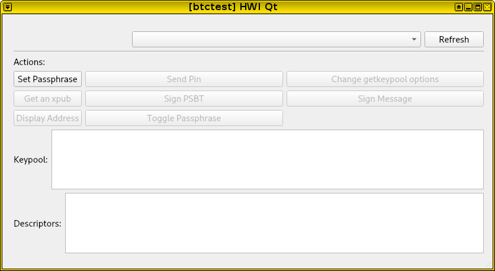

* TREZOR: your hardware wallet, e.g. Trezor, might prompt you for a passphrase, enter passphrase on hardware wallet (if any)
* HWI: select your hardware wallet in HWI GUI

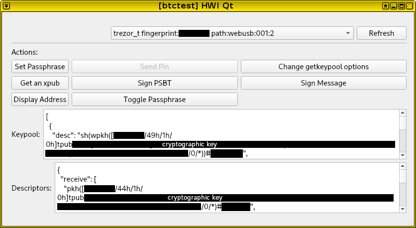

* CORE: start Bitcoin Core wallet, e.g. ``bitcoin-qt -testnet`` (or ``bitcoin-qt`` for mainnet)

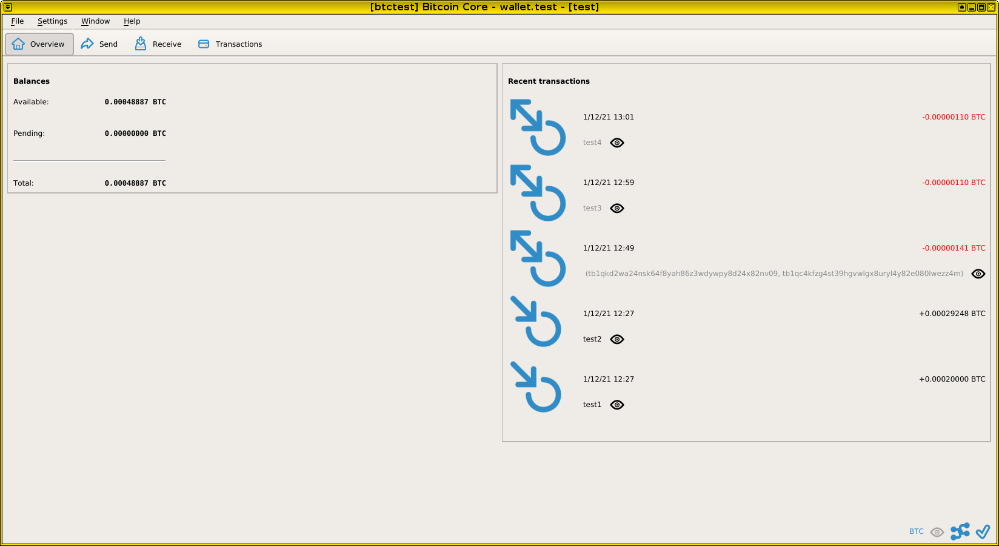

* on the very first run it might be a good idea to verify that the wallet has been created correctly
* on first run **verify your wallet** (optional)
* HWI: HWI GUI -> "Display Address", since we use BECH32 address, select "P2WPKH", 
  enter "m/84h/1h/0h/0/0" (testnet derivation path) (or "m/84h/0h/0h/0/0" on mainnet). 
  This path represents the first receiving address. Click "Go". 
  In our example, it shows address "tb1q0r2gn9wzfjm5j5zshx5yp5342h928c8pmllfep".

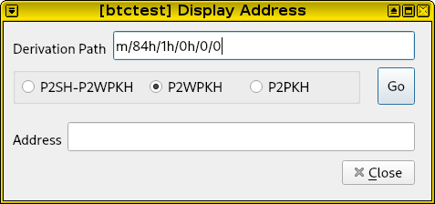

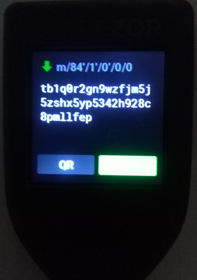

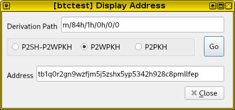

* CORE: In Core Wallet, open "Console", enter ``getaddressinfo tb1q0r2gn9wzfjm5j5zshx5yp5342h928c8pmllfep``, 
  observe these values:
  It is crucial that ``solvable`` shows as ``true``!

  * "solvable": true,
  * "iswatchonly": true,
  * "hdkeypath": "m/84'/1'/0'/0/0",

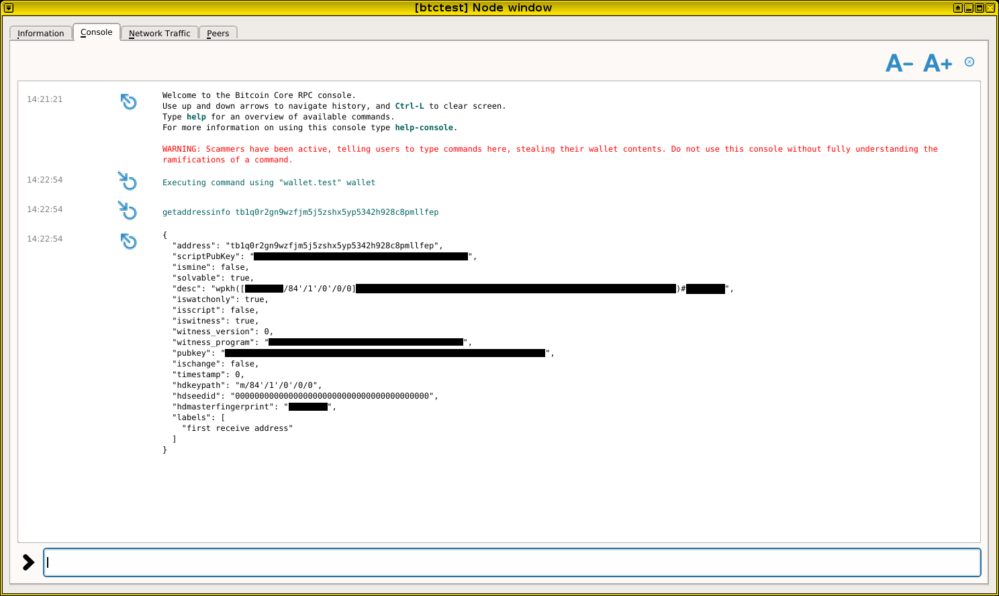

* HWI: In HWI GUI main window click "Display Address", since we use BECH32 address, 
  select "P2WPKH", enter "m/84h/1h/0h/1/0" (testnet derivation path) (or "m/84h/0h/0h/1/0" on mainnet).
  This path represents the first change address. Click "Go". 
  In our example it shows address "tb1qca3u0ka22c934jfqw7gjr9vg4gwwjldpzatrh5".

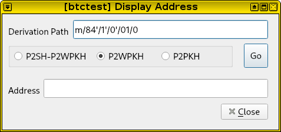

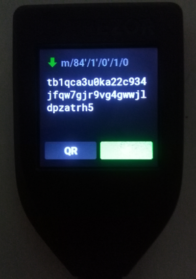

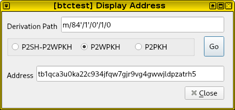

* CORE: In Core Wallet, open "Console", enter ``getaddressinfo tb1qca3u0ka22c934jfqw7gjr9vg4gwwjldpzatrh5``, 
  observe these values: 
  It is crucial that ``solvable`` shows as ``true``!

  * "solvable": true,
  * "iswatchonly": true,
  * "hdkeypath": "m/84'/1'/0'/1/0",

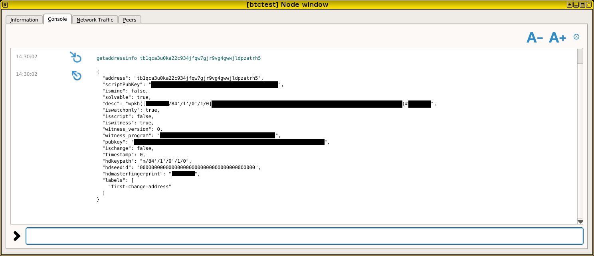

* If you see the same addresses for the same paths on Trezor, in HWI and in Bitcoin Core Wallet 
  you can rest assured that the wallet has been created correctly and 
  that the Bitcoin Core wallet corresponds to your Trezor device.

* Now let us **send funds**.

* CORE: To send funds, open the "Send" tab in Bitcoin Core Wallet, 
  then select input, amount, fees, etc. Once satisifed, click "Create Unsigned", 
  verify any displayed information, then click "Create Unsigned" again.
  The PSBT (Partially Signed Bitcoin Transaction) is now on the clipboard.

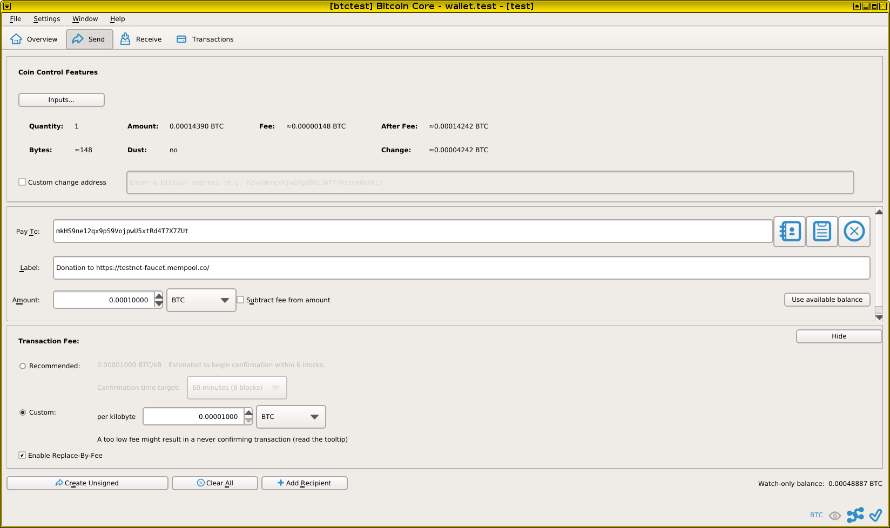

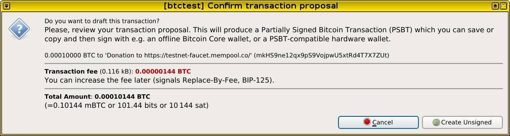

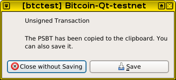

* HWI: In HWI GUI main window click "Sign PSBT", then paste PSBT from clipboard 
  into the above text field. After paste, click "Sign PSBT".

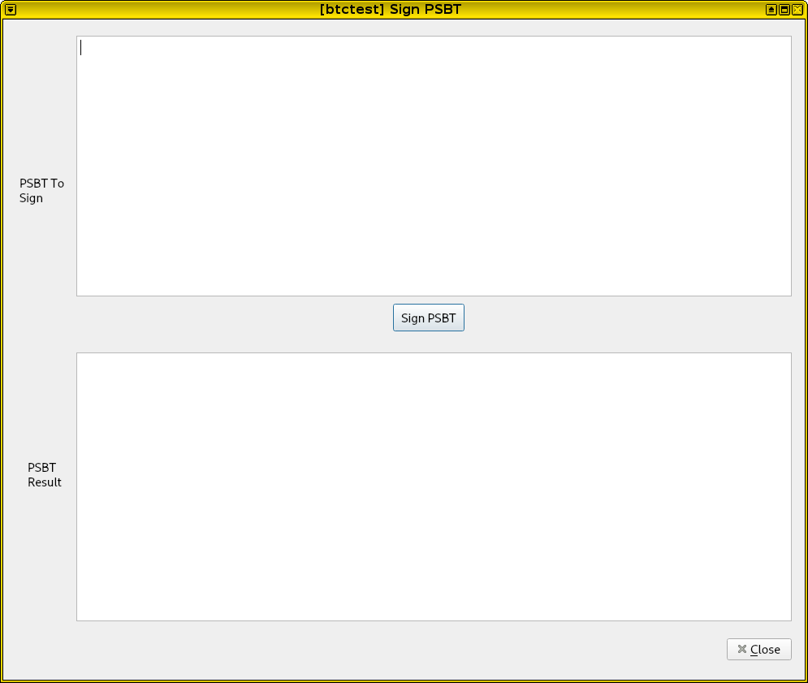

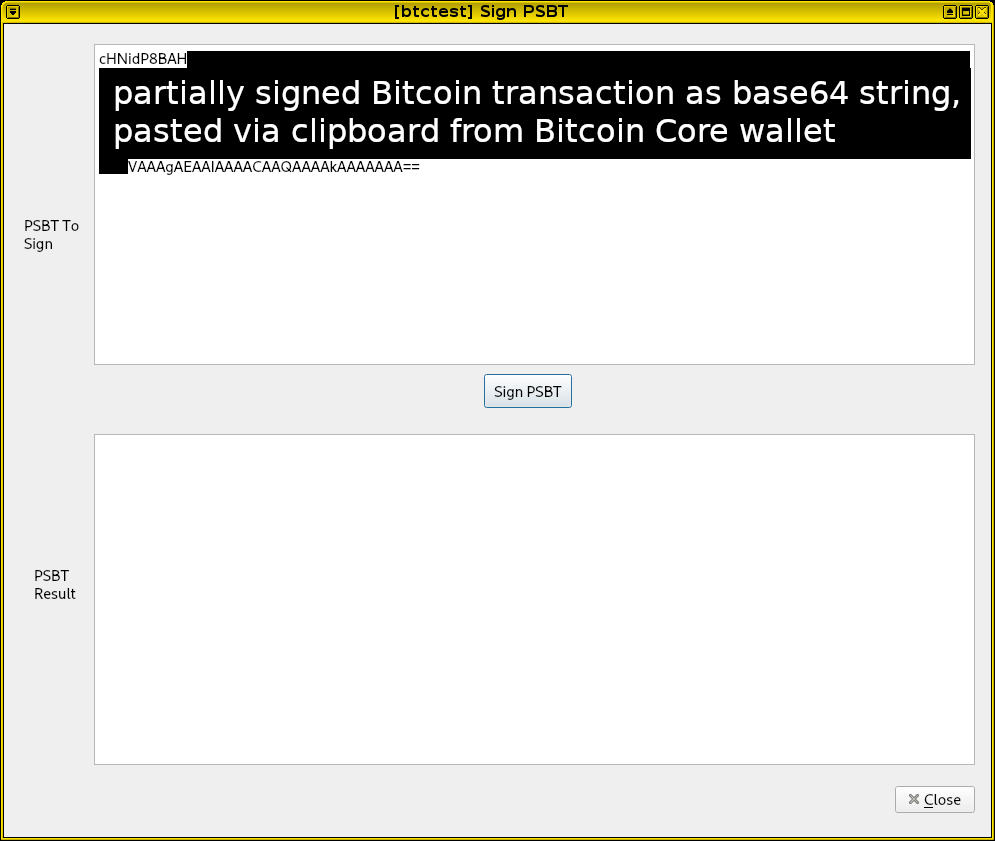

* TREZOR: verify signing on Trezor, accept operation on Trezor if all is correct

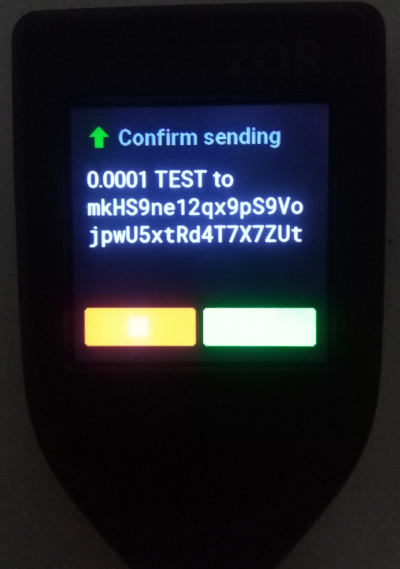

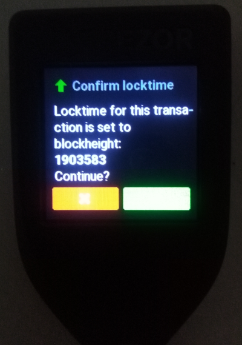

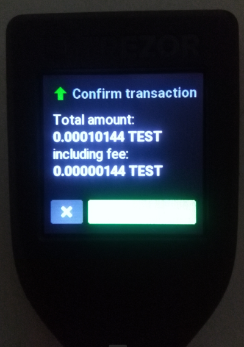

* CORE: Trezor prints blockheight of locktime which can optionally be verified in 
  Bitcoin Core Wallet (Console -> ``getblockcount``). For a simple send the locktime
  is now and you should get the current blockheight.

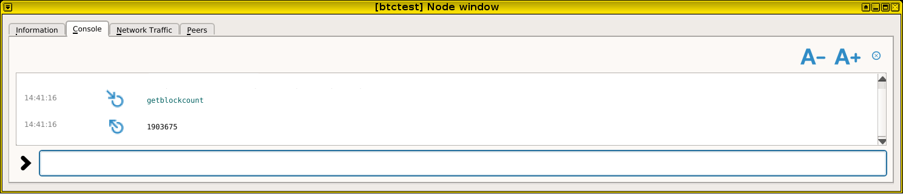

* HWI: upon accepting on Trezor, the HWI bottom text area is filled. 
  Select the bottom output, and copy full output from the bottom text area to the clipboard

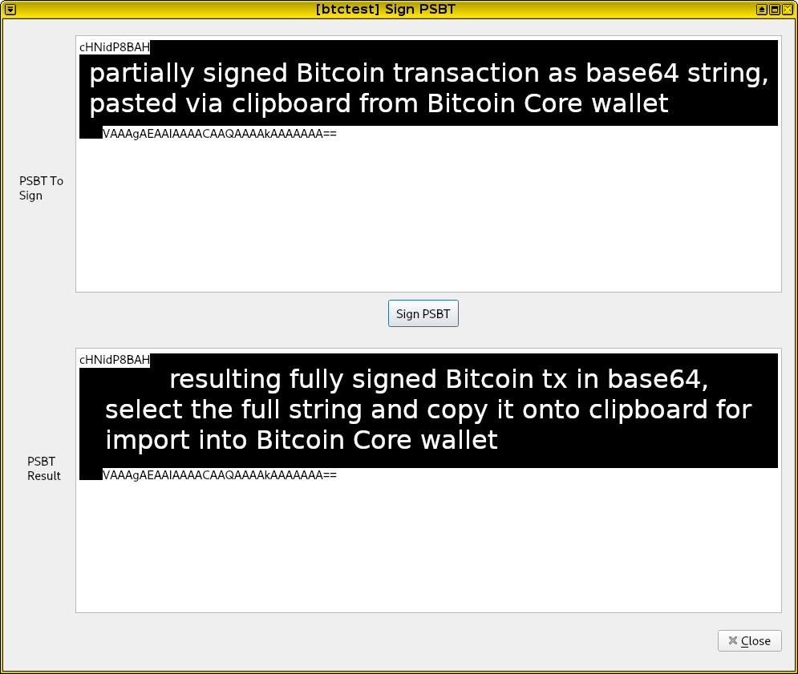

* CORE: In Bitcoin Core Wallet, go to the pull-down menu: select File -> Load from Clipboard.

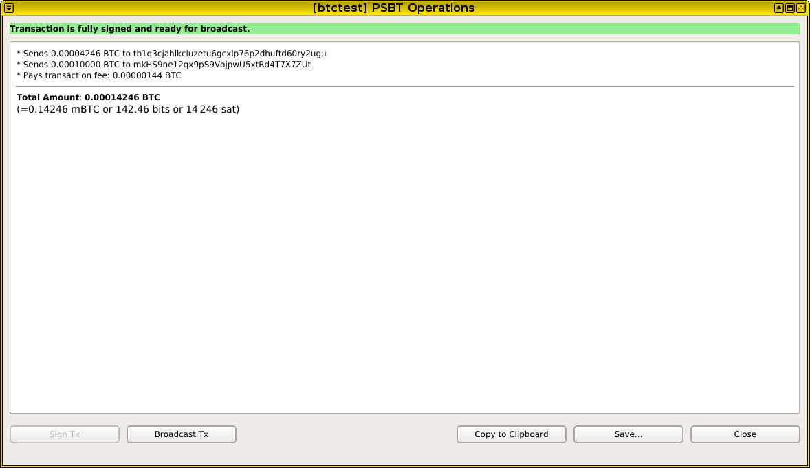

* CORE: In Core Wallet, visually verify again, then click "Broadcast Tx" button. 
  Once broadcasted, click "Close".
  The funds have been sent to the mempool awaiting confirmations on the Bitcoin network.

* CORE: In Core Wallet, go to "Transactions" tab. Here you can find the just 
  sent transaction in the top line. Wait for confirmations. 

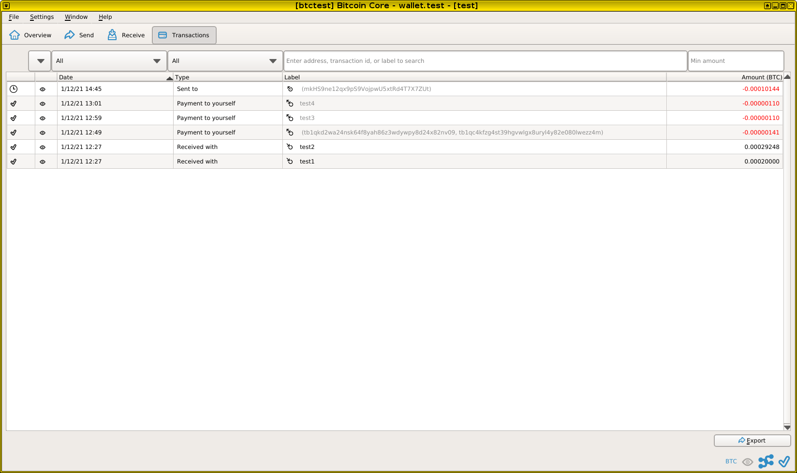

* CORE: Optionally double click transaction to see transaction details.

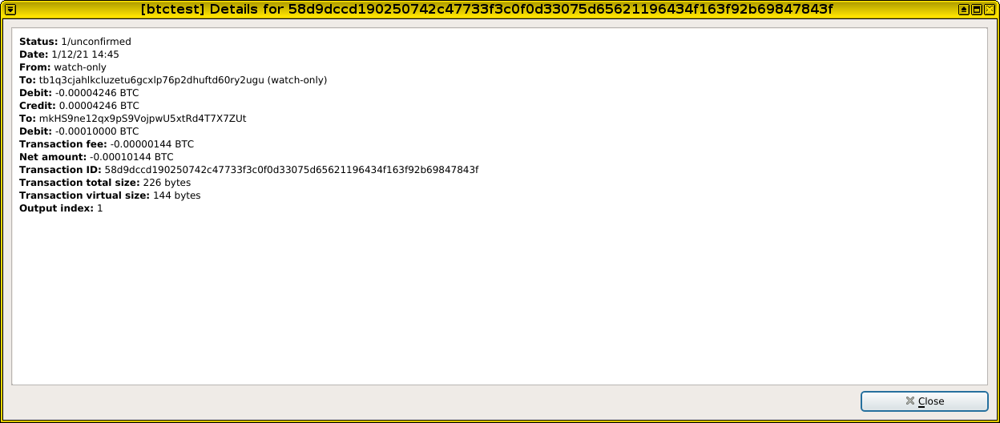

* CORE: Optionally, one can also see the transaction details in the 
  Console -> ``gettransaction 58d9dccd190250742c47733f3c0f0d33075d65621196434f163f92b69847843f``

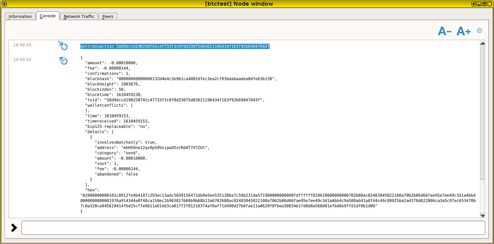

* HWI: close HWI GUI
* CORE: close Core wallet
* you are done! Pad yourself on the shoulder ;)

Versions Used
=============

* This walk-trough was done in Janary 2021
* HWI version 2.0.0-dev
* Bitcoin 0.21.0
